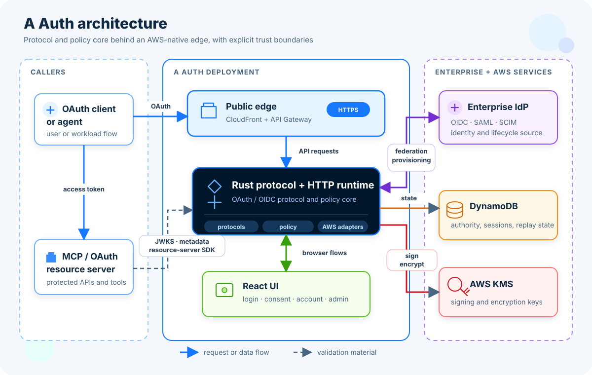

# Agent Auth


An OAuth 2.1 and OpenID Connect authorization server for AI agents, workloads,
and MCP resource servers.

[](https://github.com/amliuyong/a-auth/actions/workflows/ci.yml)
[](LICENSE)
[](https://www.rust-lang.org/)

Agent Auth is a standards-oriented authorization server built for software that
acts on behalf of people or other workloads. It gives agents an explicit,
auditable way to obtain resource-bound access tokens instead of sharing user
credentials or relying on opaque, application-specific authorization.

The project combines a Rust protocol core, an AWS serverless deployment,
resource-server SDKs, and a React administration UI. It supports conventional
OAuth and OIDC clients while adding first-class authorization boundaries for
agents, machine identities, delegation chains, and MCP resources.

> [!IMPORTANT]
> Agent Auth is pre-1.0 and under active development. Review the
> [conformance matrix](docs/CONFORMANCE.md), deployment design, and security
> assumptions before using it in a production environment. Project tests are
> not a certification by the OpenID Foundation or another standards body.

[简体中文简介](#简体中文简介) ·
[Getting started](docs/GETTING_STARTED.md) ·
[Deployment guide](docs/INSTALL_DEPLOY.md) ·
[User guide](docs/USER_GUIDE.md) ·
[Security](SECURITY.md)

## Why Agent Auth?

Traditional identity systems generally assume a human user and a pre-registered
web application. Agent systems introduce a different set of questions:

- Which agent or workload is requesting access?
- Is it acting for itself, for a user, or through a delegation chain?
- Which resource server may receive the token?
- What scopes and structured authorization constraints apply?
- How can a resource server validate the token without sharing secrets?
- How are tenant, issuer, key, and audit boundaries preserved?

Agent Auth makes these decisions part of the authorization-server contract.
Tokens are bound to an explicit resource and audience, subject and actor types
are represented directly, and security-sensitive behavior is backed by
executable conformance requirements.

## Highlights

- **OAuth 2.1 and OIDC foundations** — authorization code with PKCE, refresh
  token rotation, discovery, authorization-server metadata, UserInfo, client
  credentials, device authorization, CIBA, and token exchange.
- **Agent and workload identity** — authenticate workloads with AWS SigV4,
  OIDC assertions, SPIFFE JWT-SVIDs, or X.509-SVID mTLS profiles.
- **MCP-aware authorization** — issue single-audience, resource-bound access
  tokens and publish protected-resource metadata for MCP resource servers.
- **Explicit delegation** — represent user, agent, service, grant, actor-chain,
  scope, and rich-authorization constraints without hiding them in
  application-specific session state.
- **Modern client security** — Dynamic Client Registration, RFC 7592 client
  management, PAR, DPoP, exact redirect validation, and downgrade controls.
- **Enterprise integration** — upstream OIDC and SAML federation, passkeys,
  SCIM provisioning, security-event delivery, and administrative workflows.
- **AWS-native deployment** — Rust on Lambda behind API Gateway and
  CloudFront, with DynamoDB authority stores, KMS-backed signing, and AWS CDK
  infrastructure.
- **Resource-server SDKs** — TypeScript and Python packages for JWT, audience,
  issuer, scope, DPoP, and discovery validation.
- **Executable specification** — normative requirements are linked to exact
  automated test selectors and CI jobs.

For the precise status and evidence for each capability, use
[`docs/CONFORMANCE.md`](docs/CONFORMANCE.md) rather than this summary.

## Architecture



The protocol and policy logic is separated from AWS adapters. The same core can
run locally with in-memory stores, as a self-hosted single-tenant deployment,
or with tenant-aware issuer, storage, policy, quota, and key boundaries.

Read [`docs/DESIGN.md`](docs/DESIGN.md) for the protocol model and
[`docs/DEPLOYMENT.md`](docs/DEPLOYMENT.md) for trust boundaries and deployment
topology.

## Quick Start

### Prerequisites

- Rust 1.85 or newer
- `curl`
- `jq`

### Run the local development server

```bash
git clone https://github.com/amliuyong/a-auth.git
cd a-auth
cargo run -p agent-auth-http --bin agent-auth-server
```

The development server listens on `127.0.0.1:8080` and uses in-memory stores;
it does not require an AWS account.

In another terminal:

```bash
curl --silent http://localhost:8080/.well-known/openid-configuration | jq
```

Use `localhost`, not `127.0.0.1`, in protocol requests because the local issuer
is derived from the validated request host.

The complete local Authorization Code + PKCE walkthrough is in
[`docs/GETTING_STARTED.md`](docs/GETTING_STARTED.md).

## Deployment

The included AWS CDK application supports a self-hosted deployment and the
tenant-aware topology described in the deployment documentation.

Start with a synthesis, which does not deploy resources:

```bash
cd infra
npm ci
npm run build
npx cdk synth
```

Before deploying, read [`docs/INSTALL_DEPLOY.md`](docs/INSTALL_DEPLOY.md). It
covers prerequisites, configuration, domains, keys, migration steps, validation,
and teardown. AWS deployments can create billable resources.

## Repository Layout

| Path | Purpose |
|---|---|
| `crates/` | Rust protocol, policy, token, authentication, workload, and HTTP runtime crates |
| `infra/` | AWS CDK application, deployment configuration, and infrastructure tests |
| `web/` | React and TypeScript login, consent, account, and administration UI |
| `sdk/ts/` | TypeScript resource-server verification SDK |
| `sdk/python/` | Python resource-server verification SDK |
| `openapi/` | Generated OpenAPI contract |
| `specs/` | Capability index linked to normative conformance evidence |
| `docs/` | Architecture, protocols, operations, deployment, and user documentation |
| `e2e/` | Local and live-environment acceptance harnesses |
| `.github/conformance/` | Requirement inventory, evidence mapping, and exception policy |

## Development

Enable the repository hook after cloning:

```bash
git config core.hooksPath .githooks
```

Common checks:

```bash
cargo fmt --all -- --check
cargo test --workspace --lib --locked

npm ci
npm run lint:markdown

cd infra
npm ci
npm test
```

The CI workflow also checks Clippy, AWS adapters, exact conformance selectors,
the web application, infrastructure, OpenAPI drift, and both resource-server
SDKs.

When changing protocol behavior, update the relevant implementation, tests,
OpenAPI surface, specification, and conformance evidence together. See
[`CONTRIBUTING.md`](CONTRIBUTING.md) for the contribution workflow.

## Documentation

| Document | Start here when you want to... |
|---|---|
| [`GETTING_STARTED.md`](docs/GETTING_STARTED.md) | Run a local flow and choose a role-specific path |
| [`PROTOCOLS_101.md`](docs/PROTOCOLS_101.md) | Understand the OAuth, OIDC, MCP, DPoP, CIBA, and SPIFFE concepts |
| [`USER_GUIDE.md`](docs/USER_GUIDE.md) | Integrate a client, agent, resource server, user, or administrator |
| [`DESIGN.md`](docs/DESIGN.md) | Review protocol invariants, token contracts, and architectural decisions |
| [`DEPLOYMENT.md`](docs/DEPLOYMENT.md) | Understand issuer, tenant, key, migration, and topology boundaries |
| [`INSTALL_DEPLOY.md`](docs/INSTALL_DEPLOY.md) | Build and deploy the AWS infrastructure |
| [`CONFORMANCE.md`](docs/CONFORMANCE.md) | Check normative requirements and their automated evidence |

## Security

Security vulnerabilities must not be reported in a public issue. Use GitHub
private vulnerability reporting as described in [`SECURITY.md`](SECURITY.md).

Never commit real credentials, tokens, personal data, AWS account identifiers,
production domains, or deployment evidence. Examples and tests must use
synthetic values.

## Contributing

Issues and pull requests are welcome. Please read
[`CONTRIBUTING.md`](CONTRIBUTING.md) before submitting a change. Contributions
that affect wire behavior should include focused tests and corresponding
documentation or conformance updates.

## 简体中文简介

Agent Auth 是一个面向 AI agent、workload 和 MCP Resource Server 的 OAuth
2.1 / OpenID Connect 授权服务器。它重点解决“谁在代表谁、可以访问哪个资源、
经过了怎样的委托链、资源服务器如何独立验证权限”等 agent 授权问题，同时兼容
传统 OAuth/OIDC 客户端。

项目采用 Rust 实现协议与策略核心，提供 AWS CDK 部署、React 管理界面以及
TypeScript/Python Resource Server SDK。当前仍处于 pre-1.0 活跃开发阶段；
生产使用前请审阅 [`docs/CONFORMANCE.md`](docs/CONFORMANCE.md)、
[`docs/DESIGN.md`](docs/DESIGN.md) 和
[`docs/INSTALL_DEPLOY.md`](docs/INSTALL_DEPLOY.md)。

中文读者建议从 [`docs/GETTING_STARTED.md`](docs/GETTING_STARTED.md) 开始，
再按角色阅读 [`docs/USER_GUIDE.md`](docs/USER_GUIDE.md) 或部署文档。

## License

Licensed under the [Apache License 2.0](LICENSE).
